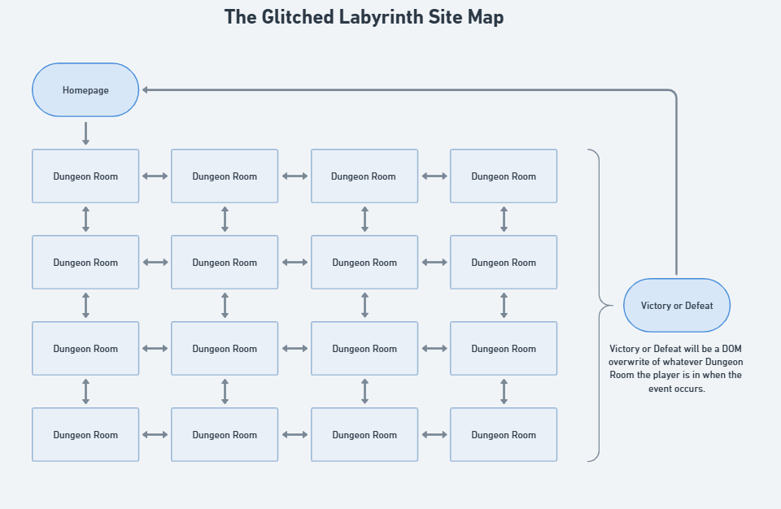
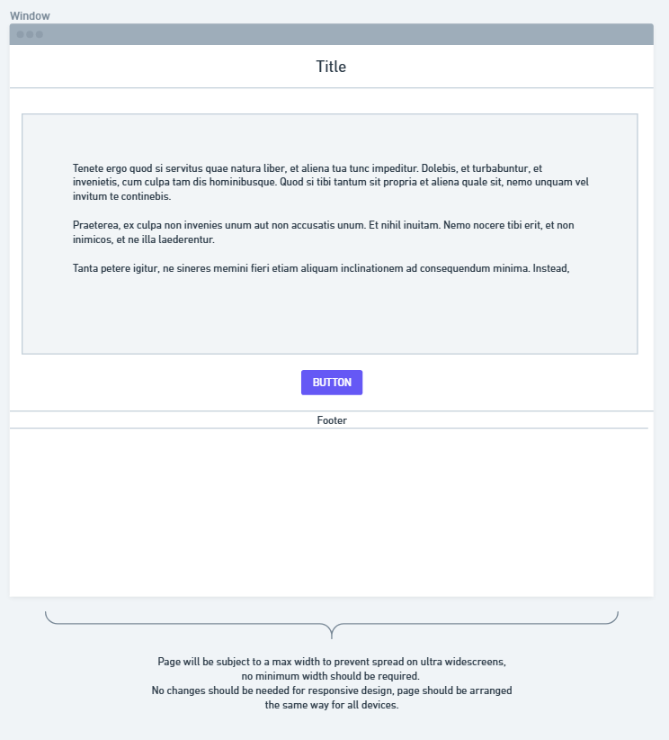
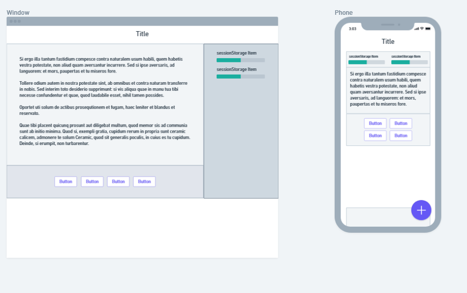
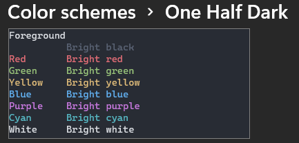

# SET08801 - Report One
By David Watkin (40803890)

Website: [https://dwatkin-dev.github.io/SET08801/](https://dwatkin-dev.github.io/SET08801/)

## Introduction

The aim of this assignment is to create a fun website, showcasing my proficiency in HTML, CSS and JavaScript. Personally, I have a little experience with these languages and web development in general but have not used these languages in a few years.

In the spirit of the assignment, I will be aiming to code everything from scratch and avoiding the use of any frameworks or nonstandard APIs.

Having recently been working through The C# Player's Guide by RB Whitaker, I immediately decided what my website would be. In the C# Players guide, one of the coding exercises is to make a dungeon crawler loosely based on the 1973 game Hunt the Wumpus by Gregory Yob. I decided this type of game would be a perfect fit for this assignment.

Unfortunately, although I knew what I wanted to create and how I was going to implement it on a technical scale, I am not a particularly imaginative or creative person. Therefore, I decided to enlist the use of ChatGPT to assist with the creative content of the website. AI was used to provide an initial set of text for the websites and the images used on the site but no HMTL, CSS or JavaScript was generated, this specific instruction was used in the prompts I provided to generate the content.

This content formed the basis of the "story" of the game, although has been modified and added to where I felt necessary.

This report details the first stages of the assignment and will deal with explaining and expanding on my idea and the plan for the initial development of the website with HTML and CSS. The following sections were written prior to performing any coding and final execution does differ from what is defined here. Rather than rewrite my report to suit where I ended up, I thought it would be a good exercise to compare the two. I have added a small reflection to each section detailing the differences between my plan and what was built.

This report will not include any detailed content or JavaScript development as these will form stage 2 of the project and will be detailed in its associated report. However, some initial considerations have been considered to ensure the projects feasibility and have been recorded within this report.

## Website Layout Overview

This website will consist of seventeen pages as it currently stands. The homepage will serve as an introduction and access point to the game with the subsequent pages providing the game map in a 4 x 4 grid, totalling 16 "rooms".

I decided to split the game map into 16 separate pages with navigation through hyperlinks as I believe this is a good method of showcasing HTML proficiency. The other option would have involved a single page with the entire game executed via DOM manipulation with JavaScript; however, I felt hyperlink navigation better suited the requirements of the assignment. There will still be DOM manipulation for the interactive events in certain rooms/pages and for defeat/death or victory conditions.

The homepage will have a single link to the entrance of the game and from there each page will link to its adjacent rooms/pages. As the layout is in a grid, edge cases will only contain relevant navigation options. For example, you will not be able to travel west from a room/page on the left edge of the grid.

> Figure One - Site Map

## Homepage Layout Overview

The homepage will be a simple single column page with 3 rows. A header block, main content block and a navigation block. These will be top aligned with whitespace below the navigation when additional vertical space is available. There will be a maximum width of 800 pixels defined to account for widescreen monitors and keep the content in the centre of the screen and easily readable without unsightly horizontal spread.

The intention is a responsive design viewable on a range of devices, from and ultrawide desktop to a mobile screen.

### Reflection on Homepage Layout

I added a couple of extra sections to the bottom of this page so I could provide a little more detail on how the game would work and what the objectives were. I decided to split it up this way to avoid bombarding the user with too much text in the main section, I feel three small text boxes are easier to read and digest over one long wall of text.

> Figure Two - Homepage Wireframe

## Dungeon Room Layout Overview

Each dungeon room will follow the same layout template. A header block and below that the screen is split into 3 sections. The right of the screen there is a full length aside which will contain any states related to the game that are going to be held in sessionStorage (e.g. player health). The left side will contain the main contents relating to the room which will be text or interactive JavaScript and below this the navigation bar will be placed with buttons appropriate to the travel options as per the site map.

As with the homepage, these will be top aligned with whitespace below the navigation when additional vertical space is available. There will be a maximum width of 800 pixels defined to account for widescreen monitors and keep the content in the centre of the screen and easily readable without unsightly horizontal spread.

The page will be responsive for smaller screens with the intention of the state bars moving from the right vertical to a horizontal style above the main content.

My current intention is that the bulk of the page will be arranged using CCS grid with the status rotation handled via CSS flex.

### Reflection on Dungeon Room Layout

I decided to completely veer from my initial layout of these pages. I liked the design I ended up with for the homepage and decided to carry this on through the rest of the site. However, after completing this stage and doing some testing, I believe the layout is not as good as could be hoped and information is lost due to the need to scroll on smaller screens like laptops and below. As such I will be creating a branch in my repository to explore some other options such as pulling the sense system into the main section block. Once I have a solution I am happy with this will be merged into the main branch.

### Reflection on website responsiveness

After trying these designs on various screen sizes, the overall responsiveness of the site is not what I envisioned. The site works but readability can be an issue due to text size and there is often a need to scroll down to be able to see all information. I am hoping the scrolling issue will be fixed with my planned changes to the room pages however, other issues will require further investigation and will be revisited at a later date once the website is fully functional.

> Figure Three - Dungeon Room Wireframe

## Design Guidelines

As the website is based on an old 1970's CLI game and is themed around web development languages, I will be aiming for a terminal style somewhere between a Linux CLI and a modern IDE or text editor.

I have looked at a number of sites with this in mind and included links below for reference.

For the colour scheme I decided to simplify the choice by using a colour set from the windows command prompt as it would suit the terminal style I am aiming for. I decided to go with the One Half Dark scheme as it is what I personally use day to day.

> Figure Four - On Half Dark Colour Scheme

This has the following colour options for use in the design:

| Description | Colour Code |
| --- | --- |
| Foreground | #DCDFE4 |
| Background | #282C34 |
| Black | #5A6374 |
| Red | #E06C75 |
| Green | #98C379 |
| Yellow | #E5C07B |
| Blue | #61AFEF |
| Purple | #C678DD |
| Cyan | #56B6C2 |
| White | #DCDFE4 |

The background will be #282c34 and any background accents will be based on the shades and tints of this colour as per the color-hex.com website:

[#282c34 on www.color-hex.com](https://www.color-hex.com/color/282c34)

The foreground colour will be used for the majority of text with accented aspects using colours from the other available options. Like a CLI game, I will attempt to tie the colours to different meanings:

- Red = danger and corruption
- Green = healing and system stability
- Blue = system concepts and web structure items
- Purple = mystery or unknown items
- Yellow = warnings and objectives

The website font will be monospace type and in order to try and cater for as many devices as possible I will be using the following:

Fira Code - Used by a lot of IDEs and editors, a nice clean monospaced font. This will be embedded via Google Fonts.

Courier New - Fallback, is the monospace standard font and should be safe for everything the others miss.

### Reflection on Design

While I generally stuck to the design guidelines I outlined above, there were some changes. The main background and the general foreground colours were changed to slightly different tones. This was primarily driven by the use of AI created images for the title and logo. These images never quite hit the right tones I requested and in order to make them blend in I decided to adjust my overall colour assignments. I also added the contrasting orange colour to additional parts of the page (navigation) as I felt contrast was something missing from my original choices and it draws the eye well.

## Initial JavaScript Requirements

As per the introduction, this report details the first stages of the assignment and will deal with explaining and expanding on my idea and the initial development of the website with HTML and CSS. However, to plan and execute the idea, I am required to think ahead and ensure what I would like to achieve is possible.

Once I had decided on the multipage website arrangement being driven via hyperlinks, I soon realised that although this simplifies the JavaScript element of the assignment a bit (although there should still be more than enough to demonstrate proficiency), it creates its own issue. For my website to work, it will need to hold data relating to player and game status. I was not sure how this was handled but some google investigation led me to the localStorage and sessionStorage JavaScript APIs. I have not defined the usage of these APIs yet, only confirmed their existence and investigated what each provides. Based on my research it would seem sessionStorage best suits my use case as there is no requirement to save status throughout multiple sessions due to the games small size.

## Software

This assignment has been produced using Phoenix Code. It is a web development specific text editor with live preview and git integration. I have found it easy and enjoyable to use and would recommend to others.

[Phoenix Code](https://phcode.io/)

Whimsical was used to produce the wireframes, sitemap and gnatt charts used in this report

[Whimsical](https://whimsical.com/)

## Reference Materials

This section contains various linked sites I viewed in coming up with the design aspects of the website and a little bit about what I liked and used form each site.

[ForrestKnight Web Terminal Portfolio](https://terminal.fkcodes.com/)

I liked the terminal design of this website, it was along the lines of what I wanted but a little too simplistic for my aims. I did used the text blur effect found on the 'help' text of this site in various places. I also wanted to use the ASCII art header idea from this and RichardApps website but after some experimentation, it wasn't really compatible with the responsive design I wanted.

[RichardApps Portfolio](https://www.richardapps.net/#home)

I loved this website and took big inspiration from it in terms of how I laid my wireframe pages out. Again I liked the ASCII art title style but couldn't make it work.

[ShellFolio Portfolio](https://evilprince2009.netlify.app/)

This site is where I got the idea for the box shadow rather than just a solid border for the box structure elements of my site.

## Planning

